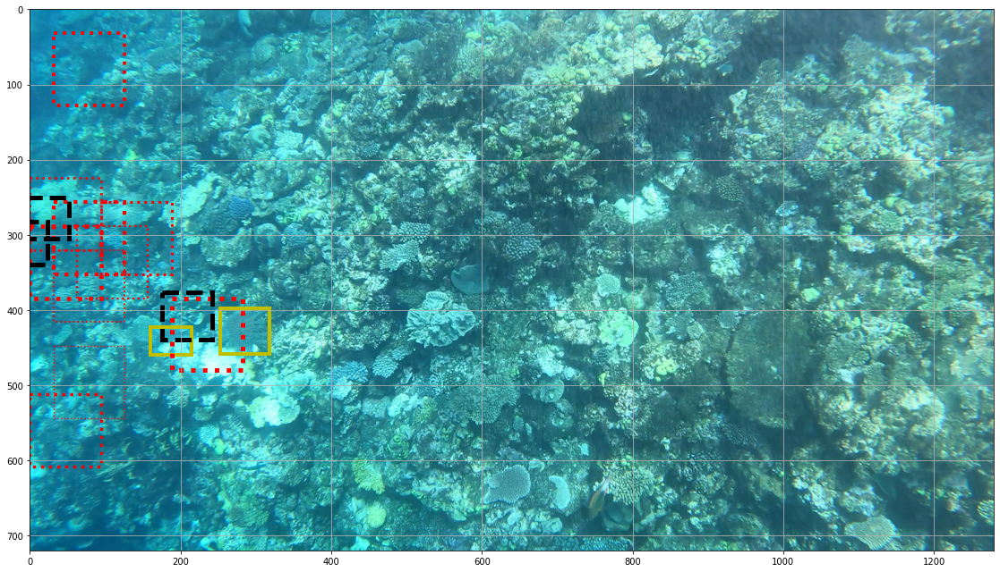

-----------------------------------
Starfish Perception Telescope (SPT)
-----------------------------------

This repository contains our solution to the Kaggle 
`TensorFlow - Help Protect the Great Barrier Reef <https://www.kaggle.com/c/tensorflow-great-barrier-reef/>`_
competition. We have implemented a slightly modified version of the 
`Faster R-CNN <https://arxiv.org/pdf/1506.01497.pdf>`_ algorithm for object detection.

Authors
=======

Sam Guns and `Neil Goeckner-Wald <https://ngoecknerwald.github.io/>`_

Both authors contributed equally and were involved in all aspects of the project.

Guide to the Code
=================

#. ``backbone.py`` : General feature extraction backbone class and subclasses to implement different architectures.
#. ``callback.py`` : Callback routines for training, used to set the learning rate versus epoch.
#. ``classifier.py`` : Final output network, note that the training calls live in ``faster_rcnn.py``.
#. ``combined_runtime.ipynb``: Colab notebook used to run the code.
#. ``data_utils.py`` : Classes for interfacing with the dataset and matching annotations with images.
#. ``evaluation.py`` : Recall metrics used to monitor training progress.
#. ``faster_rcnn.py`` : High level driver module, instantiates and trains network subcomponents.
#. ``geometry.py`` : IoU and related methods used elsewhere.
#. ``roi_pooling.py`` : Class for the RoI pooling and IoU suppression routines attached to the output of the RPN.
#. ``rpn.py`` : Region proposal network and wrapper classes.
#. ``jointmodel.py`` : Class for jointly optimizing the RPN and backbone.

To instantiate the model with a ``ResNet50`` convolutional backbone pretrained on ``ImageNet`` weights one calls:

.. code-block:: python
    
    import faster_rcnn
    
    frcnn = faster_rcnn.FasterRCNNWrapper(
        input_shape=(720, 1280, 3),
        datapath = '<path_to_competition_dataset>',
        backbone_type = 'ResNet50', #InceptionResNetV2 and VGG16 are also supported
        backbone_weights = 'finetune',
        rpn_weights = 'train',
        classifier_weights= 'train',
    )

The model can also be built with pre-trained and weights saved using the utilities

.. code-block:: python

    # Save weights
    frcnn.backbone.save_backbone('<backbone_weights>')
    frcnn.rpnwrapper.save_rpn_state('<rpn_weights>')
    frcnn.classmodel.save_classifier_state('<class_weights>')

    ...
    
    # Rebuild the model
    frcnn = faster_rcnn.FasterRCNNWrapper(
        input_shape=(720, 1280, 3),
        datapath = '<path_to_competition_dataset>',
        backbone_type = 'ResNet50',
        backbone_weights = '<backbone_weights>',
        rpn_weights = '<rpn_weights>',
        classifier_weights= '<class_weights>',
    )

The model can be fine tuned for a number of epochs by calling:

.. code-block:: python

    fine_tuning_passes = 4
    epochs_per_pass = 2

    for _ in range(fine_tuning_passes):
        frcnn.do_fine_tuning(epochs_per_pass)

resulting in substantial accuracy gains.

There are a large number of configurable hyperparameters described in the various
docstrings. They have been initialized to reasonable values for the Great Barrier Reef
dataset. The training and results shown here can be reproduced by running 
the notebook ``combined_runtime.ipynb``.

We trained this model on a Google Colab GPU for approximately 16 hours including model fine tuning.

Results
=======

The following is a representative minibatch of four images from the held out **validation** set. 
The red boxes indicate the RPN outputs after IoU supression to remove duplicate regions of interest and size 
clipping to integer (greater than 3) multiples of the backbone stride. The black boxes indicate the final 
classifier output. In both cases the width of the line indicates the probability assigned by the 
network that the region contains a starfish. The yellow boxes indicate ground truth labels.

   In this example we can see the RPN and classifier both miss a starfish that is on the scale
   of the stride of the ``ResNet50`` convolutional backbone.

   Here we see the network correctly identifying a large and visually obvious starfish, however the RPN
   and classifier layers struggle with localization.
   

   In these image we can see a number of false positives clustered around the image edges. It is 
   possible that this is an edge effect in the convolutional backbone.

These results represent the network state after four cycles of fine tuning. It is possible although unlikely 
that further training will improve the localization and detection of the network as the losses had already plateaued.

We suspect that the major limiting factor of this network is the architecture of the convolutional backbone. 
In the future we would opt for something with a significantly smaller effective stride, perhaps upsampling and 
stacking the final and penultimate convolutional layers of a ``VGG-16`` backbone.

Another option is to simply upsample the images such that the visual features of the starfish would be similar to 
the visual features in ``ImageNet`` data. We rejected this option as computationally prohibitive given our resources.

Future directions
=================

There are a number of ways in which we think this algorithm could be improved. In no particular order,
here are number of ideas that we considered but did not have time to pursue.

Training schedule improvements
------------------------------

- **Shorten the initial classifier and RPN training**: We trained both networks in isolation for 9 epochs each. We observed diminishing returns in epochs 7-9 so the final three epochs of both could be dropped in favor more joint training.

- **Change the initialization of the networks**: We found that the early training of the RPN and classifier were quite slow and required significant amounts of weight decay and a fairly aggressive gradient clip. This could be mitigated by smarter choices of initial random weights.

- **Implement label smoothing in the classifier**: The classifier is prone to overconfidence assigning classification scores of 0.0 or 1.0 to regions. This could be mitigated by label smoothing in the classifier loss function. In this version the classifier and RPN are given a binary label target based on whether there is any overlap between the ground truth box and the proposed region. A future version should scale the target classification score based on the ground truth IoU (i.e. a stronger overlap should correspond to a higher classification score).

- **Assigning different loss penalties for false positives and false negatives**: The competition is scored with an ``F2`` metric averaged over IoU thresholds between 0.3 and 0.8 meaning that false negatives are more of a problem than false positives. This could be accounted for by assigning different loss penalties for the two types of mistakes.

- **Adding noise to the feature extraction pre-training**: We pre-trained the feature extraction backbone convolutional weights on a starfish / background thumbnail classification task. To do this we placed a global average pool and dense layer on the output of the convolutional layers that were subsequently discarded after pre-training. One possible improvement would be to place a Gaussian noise augmentation and an ``L2`` regularization term after the global average pool to create a simpler boundary between starfish and background regions in the backbone output. This would be similar to (and indeed was inspired by) the resampling step in a variational auto-encoder and could result in faster initial training of the RPN and more robust final weights.

- **More diagnostic information from compiled metrics**: In this version the code reports a quantity proportional to the total recall averaged over IoU thresholds between 0.3 and 0.8. More informative metrics would be average recall and precision weighted to account for the large number of background-only images.

- **Try other optimizers**: This model uses SDG with a stepped learning rate and weight decay for all fitting except for the initial backbone training. It would be interesting to perform the same training using the ADAM optimizer.

Architecture improvements
-------------------------

- **Use an upsampled VGG-16 backbone**: Our network struggled somewhat with localization and detection of small starfish, likely due to the fact that the backbone stride was on the scale of the starfish in the images themselves. One obvious remedy is to use a convolutional backbone with a smaller effective stride. This could be done by taking the penultimate layer of a pretrained ``VGG-16`` and stacking it with an upsampled version of the final convolutional layer. This has been shown to work in `An Improved Faster R-CNN for Small Object Detection <https://ieeexplore.ieee.org/document/8786135/>`_.

- **Use GIoU loss for localization**: This has been shown to improve localization in Faster R-CNN algorithms relative to the L1 bounding box loss that we used. We used `GIoU <https://giou.stanford.edu/>`_ in early versions of the network but later dropped it for simplicity.

- **Use a YOLO architecture**: A single stage detection network could have been simpler to implement and faster to train. 

- **Learn temporal correlations**: There are strong correlations between subsequent images in the training videos which could be exploited by a two-stage detection system. One simple way to do this would be to pass the RoI and pooled features as well as a smoothly varying spatial function from the last ``n ~ 4`` images to the final dense layer in the classifier. This would require another set of training epochs and a data loading interface that does not randomly reshuffle the images.

Dataset improvements
--------------------

- **Dropping background-only images**: The input dataset was quite unbalanced with many more background-only images than images containing starfish. We ended up mostly ignoring many of these images by enforcing a balanced sample in the RPN and classifier training. We were unable to get sample reweighting to work reliably. This resulted in unnecessary calls to the feature extraction backbone which slowed down training. Simply ignoring some of these images alltogether could have resulted in faster training epochs.

- **Better feature scaling**: This model uses the default feature scaling inherited from the ``ImageNet`` dataset before the convolutional backbone. The images in this dataset are significantly more monochromatic and bluer than the ``ImageNet`` dataset meaning we would likely see improvement from feature scaling better matched to this dataset.